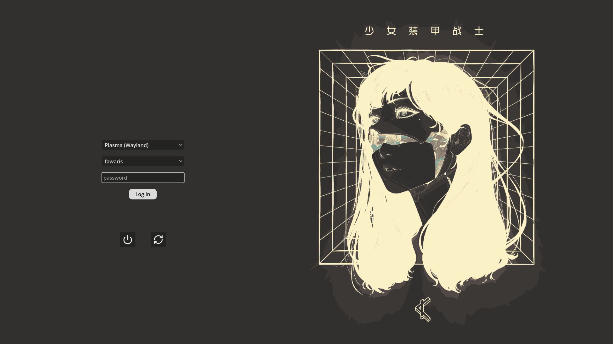

# Aisatsu

A greeter for [Greetd](https://man.sr.ht/~kennylevinsen/greetd/).

Made with the [Godot game engine](https://godotengine.org/)... **Is this a good idea?** I don't know, but it's fun and it works pretty well •ᴗ•

  

## Getting Started

Work in progress.

## Credits

- The original background art was made by [Gharliera](https://gharliera.com/) ([wallpaper link](https://wallhaven.cc/w/k899o7))
	- I forgot where I got the specific image that I'm using with that color scheme. I also edited the image to move the girl's face to the right.

- Thanks to [gtkgreet](https://git.sr.ht/~kennylevinsen/gtkgreet) and [ReGreet](https://github.com/rharish101/ReGreet) for their reference implementations.
